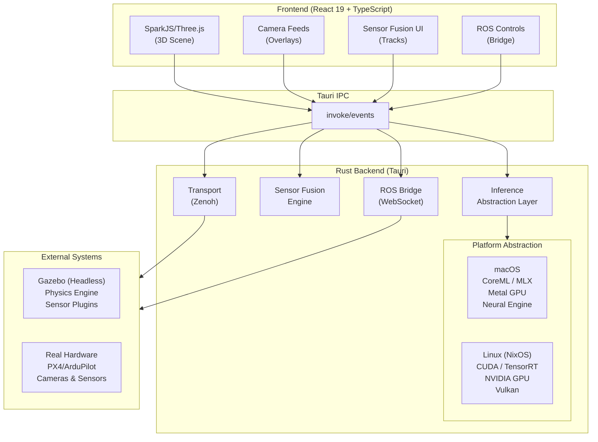
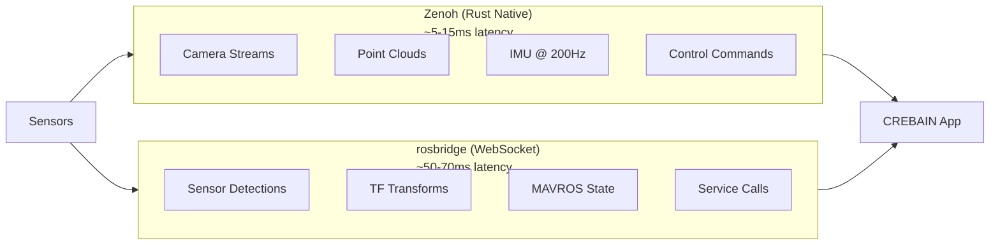
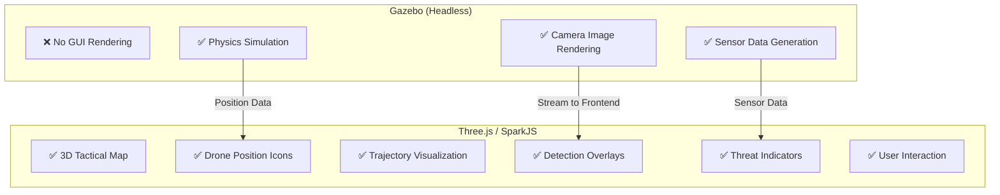
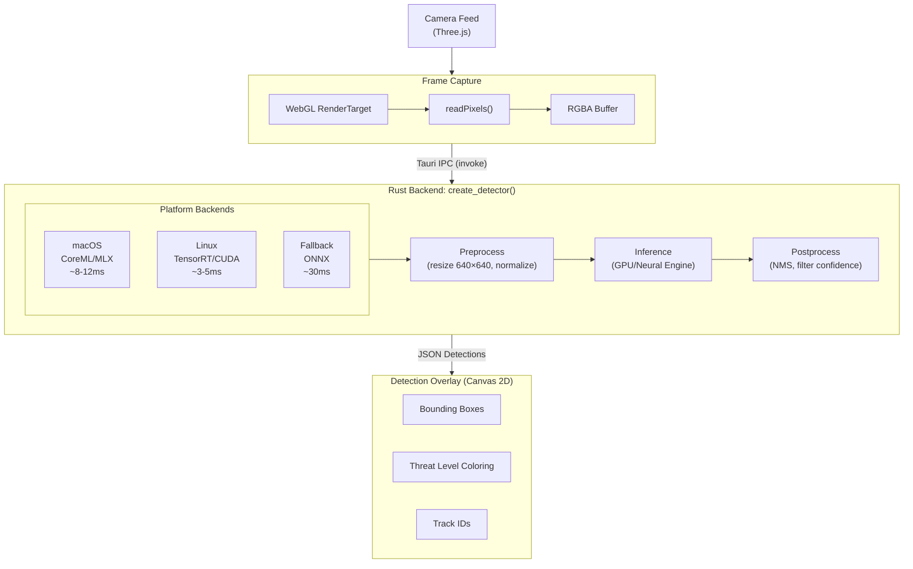
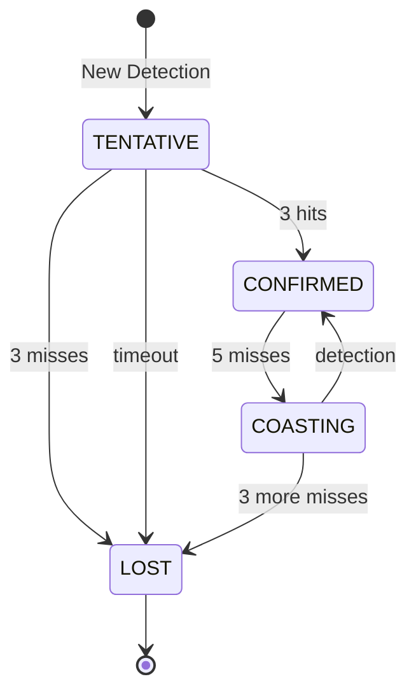

# CREBAIN

**Adaptive Response & Awareness System (ARAS)**

*DE: Adaptives Reaktions- und Aufklärungssystem (ARAS)*
Version 0.4.0 | System Core v4.0.0

<p align="center">
  
</p>

A professional-grade tactical reconnaissance platform with 3D Gaussian Splatting visualization, multi-camera surveillance, ML-based drone detection, advanced multi-modal sensor fusion, drone physics simulation, and low-latency ROS-Gazebo integration. Built with Tauri 2, React 19, SparkJS/Three.js, and platform-native ML acceleration (CoreML/Metal on macOS, CUDA/TensorRT on Linux).

---

## Table of Contents

- [Features](#features)
- [Architecture Overview](#architecture-overview)
- [Design Philosophy](#design-philosophy)
- [Technology Stack](#technology-stack)
- [Installation](#installation)
  - [macOS (Apple Silicon)](#macos-apple-silicon)
  - [NixOS (NVIDIA CUDA)](#nixos-nvidia-cuda)
- [Usage](#usage)
- [Keyboard Controls](#keyboard-controls)
- [System Architecture](#system-architecture)
  - [Frontend Architecture](#frontend-architecture)
  - [Backend Architecture](#backend-architecture)
  - [Communication Layer](#communication-layer)
- [ML Inference Pipeline](#ml-inference-pipeline)
- [Sensor Fusion System](#sensor-fusion-system)
- [ROS-Gazebo Integration](#ros-gazebo-integration)
- [Communication Protocols](#communication-protocols)
- [Cross-Platform Support](#cross-platform-support)
- [Performance Optimizations](#performance-optimizations)
- [Configuration](#configuration)
- [Project Structure](#project-structure)
- [Development Roadmap](#development-roadmap)
- [Contributing](#contributing)
- [License](#license)

---

## Features

### Core Capabilities

| Capability | Description | Status |
|------------|-------------|--------|
| **3D Visualization** | Gaussian Splatting + GLB/GLTF models via Three.js | In Progress |
| **Multi-Camera Surveillance** | Up to 4 simultaneous camera feeds with PTZ control | In Progress |
| **ML Detection** | Real-time object detection with platform-native acceleration | In Progress |
| **Sensor Fusion** | 5 filter algorithms (KF/EKF/UKF/PF/IMM) for multi-modal tracking | In Progress |
| **Drone Physics** | 120Hz quadcopter aerodynamics simulation | In Progress |
| **ROS Integration** | rosbridge WebSocket + Zenoh low-latency transport | In Progress |
| **Cross-Platform** | macOS (Apple Silicon) + NixOS (CUDA) | In Progress |

### 3D Visualization
- **Gaussian Splatting**: Load and view 3D Gaussian Splat scenes (.spz, .ply, .splat, .ksplat)
- **GLB/GLTF Support**: Import 3D models for tactical overlays
- **Real-time Rendering**: Three.js with WebGPU (Metal/Vulkan), fallback to WebGL 2.0
- **First-Person Navigation**: WASD movement, Q/E for vertical, Shift to sprint
- **Drone Visualization**: Real-time 3D drone models with rotor animation

### Multi-Camera Surveillance System
- **Camera Types**:
  - `SK` (Statische Kamera): Fixed surveillance position
  - `PTZ` (Pan-Tilt-Zoom): Full PTZ control with sliders
  - `PK` (Patrouillenkamera): Automated waypoint patrol
- **Live Feeds**: Up to 4 camera feeds rendered simultaneously at 12 FPS
- **Feed Export**: Download individual camera captures as PNG
- **Detection Overlay**: Real-time bounding boxes on camera feeds
- **Camera Management**: Place, rename, and remove cameras via UI

### ML Detection Pipeline
- **Platform-Native Acceleration**:
  - macOS: CoreML / MLX (Metal GPU + Neural Engine)
  - Linux: CUDA / TensorRT (NVIDIA GPU)
  - Fallback: ONNX Runtime (CPU)
- **YOLOv8s Model**: Object detection with 80 COCO classes
- **Detection Classes** (tactical mapping):
  - `drone` - highest threat priority
  - `bird` - environmental
  - `aircraft` - potentially friendly
  - `helicopter` - potentially friendly
  - `unknown` - requires analysis

### Advanced Sensor Fusion

| Algorithm | Use Case | Latency |
|-----------|----------|---------|
| **Kalman Filter (KF)** | Linear constant-velocity tracking | <0.5ms |
| **Extended Kalman Filter (EKF)** | Non-linear with linearization | ~0.5ms |
| **Unscented Kalman Filter (UKF)** | Highly non-linear systems | ~1ms |
| **Particle Filter (PF)** | Multi-modal distributions | ~2ms |
| **IMM** | Maneuvering targets | ~1.5ms |

### UI/UX
- **NATO-Compliant Interface**: VS-NfD classification system
- **Threat Level Indicators**: 5-level system (0=unknown to 4=critical)
- **Austere Military Aesthetic**: Grayscale with tactical color meaning only
- **German Localization**: Full German language interface
- **Draggable Panels**: All panels can be repositioned with edge snapping
- **Responsive Design**: All text uses em-based scaling for consistency

---

## Architecture Overview



---

## Design Philosophy

### 1. Latency-First Architecture

**Problem**: Traditional ROS visualization tools (RViz, Foxglove) add 50-100ms latency through WebSocket+JSON encoding.

**Solution**: Dual-transport architecture with Zenoh for latency-critical data.



**Zenoh**: Shared memory, binary, zero-copy - use for latency-critical data  
**rosbridge**: Dynamic, no recompile needed - use for flexibility and debugging

### 2. Platform-Native Performance

**Problem**: Cross-platform ML frameworks (ONNX, TFLite) don't fully utilize hardware accelerators.

**Solution**: Compile-time platform detection with native backends.

```rust
// Automatic backend selection
pub fn create_detector() -> Box<dyn Detector> {
    #[cfg(target_os = "macos")]
    {
        // Apple Silicon: MLX > CoreML > ONNX
        if mlx::is_available() { return Box::new(MlxDetector::new()); }
        if coreml::is_available() { return Box::new(CoreMlDetector::new()); }
    }
    #[cfg(target_os = "linux")]
    {
        // NVIDIA: TensorRT > CUDA > ONNX
        if tensorrt::is_available() { return Box::new(TensorRtDetector::new()); }
        if cuda::is_available() { return Box::new(CudaDetector::new()); }
    }
    Box::new(OnnxDetector::new()) // Universal fallback
}
```

**Justification**:
- CoreML uses Neural Engine (16 TOPS on M1) - 5-10x faster than CPU
- TensorRT optimizes for specific GPU architecture - 2-3x faster than generic CUDA
- Fallback ensures the system works everywhere

### 3. Headless Simulation, Rich Visualization

**Problem**: Gazebo's GUI competes for GPU resources and doesn't integrate with custom UIs.

**Solution**: Run Gazebo headless; render everything in SparkJS/Three.js.



**Gazebo**: GPU not wasted on 3D viewport - focused on physics and sensors  
**Three.js**: Full control over UX with 60fps interactive UI

### 4. Sim2Real Awareness

**Problem**: Simulated sensor data doesn't transfer perfectly to real hardware.

**Solution**: Use simulation for logic testing, not perception training.

| Use Gazebo For | Don't Use Gazebo For |
|----------------|---------------------|
| UI/UX development | Final detection model training |
| Integration testing | Control loop tuning |
| Mission state machines | Aerodynamic performance |
| Multi-drone coordination | Real sensor noise modeling |
| Safe failure mode testing | Production deployment |

### 5. Reproducible Builds

**Problem**: "Works on my machine" - different CUDA versions, missing dependencies.

**Solution**: Nix flake for hermetic, reproducible builds across platforms.

```bash
# Same command works on macOS and NixOS
nix develop   # Enter dev environment with all dependencies
nix build     # Build for current platform
```

---

## Technology Stack

| Layer | Technology | Justification |
|-------|------------|---------------|
| **Frontend** | React 19, TypeScript, Tailwind 4 | Modern, type-safe, fast iteration |
| **3D Rendering** | Three.js, @sparkjsdev/spark | Gaussian Splatting + WebGPU |
| **Desktop Framework** | Tauri 2.10 (Rust) | Native performance, small binary |
| **ML Inference** | CoreML/MLX (macOS), TensorRT/CUDA (Linux) | Platform-native acceleration |
| **Sensor Fusion** | nalgebra (Rust) | SIMD-optimized linear algebra |
| **Transport** | Zenoh (Rust), rosbridge (WebSocket) | Low-latency + flexibility |
| **Build System** | Nix, Cargo, Vite, Bun | Reproducible, fast |

---

## Installation

### macOS (Apple Silicon)

```bash
# Prerequisites
xcode-select --install
brew install bun rust

# Clone and setup
git clone https://github.com/crebain/crebain.git
cd crebain
bun install

# Build backend (CoreML is used automatically on macOS)
cd src-tauri && cargo build --release && cd ..

# Run
bun run tauri dev
```

### NixOS (NVIDIA CUDA)

```bash
# Clone
git clone https://github.com/crebain/crebain.git
cd crebain

# Enter Nix dev environment (auto-detects CUDA on NixOS with NVIDIA drivers)
nix develop
#
# If CUDA isn't detected (or you're on a non-standard setup), force the CUDA shell:
# nix develop .#cuda
#
# The Nix shells set `LD_LIBRARY_PATH` for CUDA/TensorRT and driver libraries.
# If you hit an ONNX Runtime load/version error, set `ORT_DYLIB_PATH` to a compatible `libonnxruntime.so`.

# Install frontend deps and run
bun install
bun run tauri dev
```

### Model Setup

Place your ML model in the appropriate format:

| Platform | Model Path | Format |
|----------|-----------|--------|
| macOS | `CREBAIN_MODEL_PATH=/path/to/model.mlmodelc` | CoreML (`.mlmodelc` directory) |
| Linux (NVIDIA) | `CREBAIN_ONNX_MODEL=/path/to/model.onnx` | ONNX (CUDA/TensorRT via ONNX Runtime) |

This repo does **not** ship model weights. Provide your own model files and ensure you have the rights to redistribute them.

For local development you can also drop models into these paths (ignored by git):

- `src-tauri/resources/yolov8s.mlmodelc/` (macOS)
- `src-tauri/resources/yolov8s.onnx` (Linux)

Or set environment variables:
```bash
export CREBAIN_MODEL_PATH=/path/to/your/model
export CREBAIN_ONNX_MODEL=/path/to/your/model.onnx
```

---

## Usage

1. **Launch the app**: `bun run tauri dev`
2. **Load a scene**: Drag and drop a .spz/.ply/.splat file, or use Ctrl+O
3. **Place cameras**: Press 1/2/3 to enter camera placement mode, click to place
4. **Enable detection**: Detection runs automatically on camera feeds
5. **View performance**: Press P to toggle the performance panel
6. **Sensor fusion**: Press U to toggle the sensor fusion panel
7. **Connect ROS**: Press N to open the ROS connection panel

---

## Keyboard Controls

### Navigation
| Key | Action |
|-----|--------|
| W/A/S/D | Move forward/left/back/right |
| Q/E | Move down/up |
| Shift | Sprint (3x speed) |
| Ctrl | Precision mode (0.2x speed) |
| Space | Emergency stop |
| R | Reset camera to origin |

### Camera System
| Key | Action |
|-----|--------|
| 1 | Place Static Camera (SK) |
| 2 | Place PTZ Camera |
| 3 | Place Patrol Camera (PK) |
| Tab | Cycle through cameras |
| V | Toggle camera feeds |

### Panels & UI
| Key | Action |
|-----|--------|
| P | Toggle Performance Panel |
| F | Focus scene content |
| G | Toggle 3D grid |
| N | Toggle ROS Connection Panel |
| U | Toggle Sensor Fusion Panel |
| T | Toggle detection panel |
| Y | Toggle detection on/off |

---

## System Architecture

### Frontend Architecture

```
src/
├── components/
│   ├── CrebainViewer.tsx      # Main 3D viewer (orchestrates everything)
│   ├── CameraFeed.tsx         # Individual camera with detection overlay
│   ├── CameraGrid.tsx         # Multi-camera layout
│   ├── DetectionOverlay.tsx   # Bounding box rendering
│   └── *Panel.tsx             # Draggable UI panels
│
├── hooks/
│   ├── useGazeboDrones.ts     # Drone state from ROS (CircularBuffer, memoized)
│   ├── useGazeboSimulation.ts # Continuous guidance controller
│   ├── useROSSensors.ts       # Sensor fusion integration
│   └── useDraggable.ts        # Shared panel drag logic
│
├── ros/
│   ├── ROSBridge.ts           # WebSocket client (rosbridge)
│   ├── ROSCameraStream.ts     # Camera frame decoding
│   ├── GuidanceController.ts  # 20Hz PD control loop
│   ├── TransformManager.ts    # TF tree with caching
│   └── WaypointManager.ts     # MAVROS mission support
│
└── lib/
    ├── CircularBuffer.ts      # O(1) position history
    └── mathUtils.ts           # Optimized vector math (distanceSquared)
```

### Backend Architecture

```
src-tauri/src/
├── lib.rs                # Tauri commands (IPC entry points)
├── main.rs               # Native app entry
│
├── inference/            # ML abstraction layer
│   ├── mod.rs            # Detector trait + factory
│   ├── coreml.rs         # macOS CoreML backend
│   ├── mlx.rs            # macOS MLX backend
│   ├── cuda.rs           # Linux CUDA backend
│   ├── tensorrt.rs       # Linux TensorRT backend
│   └── onnx.rs           # Cross-platform fallback
│
├── transport/            # Communication layer
│   ├── mod.rs            # Transport trait + types
│   └── zenoh.rs          # Zenoh implementation
│
└── sensor_fusion.rs      # KF/EKF/UKF/PF/IMM (1400+ lines)
```

### Communication Layer


---

## ML Inference Pipeline

### Detection Flow



### Performance by Platform

| Platform | Backend | Inference | Total Latency |
|----------|---------|-----------|---------------|
| M3 Pro | CoreML (Neural Engine) | 8-12ms | 15-20ms |
| M3 Pro | MLX (Metal GPU) | 10-15ms | 18-25ms |
| RTX 4090 | TensorRT (FP16) | 3-5ms | 8-12ms |
| RTX 4090 | CUDA | 5-8ms | 12-18ms |
| Any CPU | ONNX Runtime | 25-40ms | 40-60ms |

---

## Sensor Fusion System

### Filter Selection Guide

| Scenario | Recommended Filter | Why |
|----------|-------------------|-----|
| Constant velocity targets | Kalman Filter | Optimal, fastest |
| Radar/acoustic (non-linear) | Extended Kalman | Handles measurement non-linearity |
| Highly non-linear dynamics | Unscented Kalman | No Jacobian computation |
| Multi-modal distributions | Particle Filter | Handles non-Gaussian |
| Maneuvering targets | IMM | Switches between motion models |

### Track State Machine



---

## ROS-Gazebo Integration

### Supported Topics

```yaml
# Drone State (subscribe)
/gazebo/model_states:              gazebo_msgs/ModelStates
/mavros/*/local_position/pose:     geometry_msgs/PoseStamped
/mavros/*/state:                   mavros_msgs/State

# Camera (subscribe via Zenoh)
/*/camera/image_raw/compressed:    sensor_msgs/CompressedImage
/*/camera/camera_info:             sensor_msgs/CameraInfo

# Control (publish)
/mavros/*/setpoint_position/local: geometry_msgs/PoseStamped
/mavros/*/setpoint_velocity/cmd_vel: geometry_msgs/TwistStamped

# Sensor Fusion (subscribe)
/crebain/thermal/detections:       crebain_msgs/ThermalDetectionArray
/crebain/acoustic/detections:      crebain_msgs/AcousticDetectionArray
/crebain/radar/detections:         crebain_msgs/RadarDetectionArray
```

### Quick Start

```bash
# Terminal 1: Gazebo (headless) with Zenoh RMW
export RMW_IMPLEMENTATION=rmw_zenoh_cpp
gzserver --headless your_world.sdf

# Terminal 2: CREBAIN
cd crebain && bun run tauri dev
```

---

## Communication Protocols

### Protocol Comparison

| Factor | rosbridge (WebSocket) | Zenoh (Native) |
|--------|----------------------|----------------|
| **Latency** | ~50-70ms | ~5-15ms |
| **Encoding** | JSON + base64 | Binary, zero-copy |
| **Setup** | Easy | Requires RMW change |
| **Add Sensors** | Dynamic (no recompile) | Needs Rust types |
| **ROS1 Support** | Yes | No |
| **Debugging** | Browser DevTools | Harder |

### When to Use Each

**rosbridge**: Development, ROS1, experimental sensors, flexibility needed

**Zenoh**: Production, low-latency critical, high-bandwidth (cameras, LIDAR)

---

## Cross-Platform Support

### Platform Matrix

| Component | macOS (Apple Silicon) | NixOS (NVIDIA) |
|-----------|----------------------|----------------|
| ML Inference | CoreML / MLX | CUDA / TensorRT |
| GPU Compute | Metal | CUDA |
| 3D Rendering | Metal via WebGPU | Vulkan via WebGPU |
| Build System | Nix / Homebrew | Nix |
| Gazebo | Native / Docker | Native |

### Environment Variables

| Variable | Description | Values |
|----------|-------------|--------|
| `CREBAIN_MODEL_PATH` | ML model path | Path to `.mlmodelc` or `.onnx` |
| `CREBAIN_ONNX_MODEL` | ONNX model path (override) | Path to `.onnx` |
| `CREBAIN_BACKEND` | Force ML backend | `coreml`, `mlx`, `tensorrt`, `cuda`, `onnx` |
| `CREBAIN_ENABLE_EXPERIMENTAL_MLX` | Allow MLX auto-selection on Apple Silicon | `1` / `true` |
| `CREBAIN_TRT_CACHE_DIR` | TensorRT engine cache dir | Directory path (Linux) |
| `CREBAIN_DISABLE_TRT_CACHE` | Disable TensorRT caching | `1` / `true` |
| `ORT_DYLIB_PATH` | ONNX Runtime library path (load-dynamic) | Path to `libonnxruntime.*` |
| `CREBAIN_ZENOH` | Enable Zenoh | `1` (default) or `0` |
| `RMW_IMPLEMENTATION` | ROS2 middleware | `rmw_zenoh_cpp` |

---

## Performance Optimizations

### Implemented Optimizations

| Optimization | Location | Impact |
|--------------|----------|--------|
| CircularBuffer for position history | `useGazeboDrones.ts` | O(n) → O(1) |
| Memoized derived state | `useGazeboDrones.ts` | No recompute on every render |
| Squared distance comparisons | `InterceptionSystem.ts` | Avoids sqrt() |
| Selective trajectory prediction | `useGazeboSimulation.ts` | 80% reduction |
| 20Hz continuous guidance | `GuidanceController.ts` | Smooth control |
| Stable config refs | Various hooks | Avoids effect re-runs |
| ImageBitmap decoding | `ROSCameraStream.ts` | GPU-accelerated |

### Benchmarks (M3 Pro)

| Metric | Value |
|--------|-------|
| ML Inference | 8-12ms |
| Sensor Fusion (EKF) | ~0.5ms |
| Camera Render | ~2ms |
| Physics Step (120Hz) | <0.5ms |
| Total Frame Time | ~20-30ms |

---

## Configuration

### Detection Settings

| Parameter | Default | Range |
|-----------|---------|-------|
| Confidence Threshold | 0.25 | 0.0-1.0 |
| IOU Threshold | 0.45 | 0.0-1.0 |
| Max Detections | 100 | 1-1000 |

### Sensor Fusion Settings

| Parameter | Default | Description |
|-----------|---------|-------------|
| Algorithm | EKF | Filter algorithm |
| Process Noise | 1.0 | State uncertainty |
| Measurement Noise | 2.0 | Sensor uncertainty |
| Association Threshold | 10.0m | Track matching distance |

### Guidance Controller Settings

| Parameter | Default | Description |
|-----------|---------|-------------|
| Rate | 20Hz | Control loop frequency |
| Max Velocity | 15 m/s | Speed limit |
| kP | 1.5 | Proportional gain |
| kD | 0.5 | Derivative gain |

---

## Project Structure

```
crebain/
├── src/                          # React frontend
│   ├── components/               # UI components
│   ├── hooks/                    # React hooks
│   ├── ros/                      # ROS integration
│   ├── detection/                # Detection types
│   ├── physics/                  # Drone physics
│   ├── simulation/               # Interception system
│   └── lib/                      # Utilities
│
├── src-tauri/                    # Rust backend
│   ├── src/
│   │   ├── inference/            # ML abstraction layer
│   │   ├── transport/            # Zenoh transport
│   │   └── sensor_fusion.rs      # Filter algorithms
│   ├── native/
│   │   └── coreml-ffi/           # Swift CoreML bridge
│   └── resources/                # ML models
│
├── ros/                          # ROS reference files
│   ├── msg/                      # Message definitions
│   ├── srv/                      # Service definitions
│   └── launch/                   # Launch files
│
├── flake.nix                     # Nix build configuration
├── package.json                  # Frontend dependencies
└── README.md                     # This file
```

---

## Development Roadmap

### In Progress (v0.4.0)

- [ ] Core 3D visualization with Gaussian Splatting
- [ ] Multi-camera surveillance system
- [ ] ML detection pipeline (CoreML/CUDA)
- [ ] Sensor fusion (5 algorithms)
- [ ] ROS integration (rosbridge)
- [ ] Performance optimizations (CircularBuffer, memoization)
- [ ] Zenoh transport layer (stub implementation)
- [ ] Cross-platform ML abstraction
- [ ] Nix flake for reproducible builds

### In Progress (v0.5.0)

- [ ] Full Zenoh integration with camera streaming
- [ ] TensorRT engine building from ONNX
- [ ] MLX detector implementation
- [ ] WebGPU renderer (Three.js r160+)

### Planned (v0.6.0)

- [ ] Hardware-in-the-loop (HIL) testing
- [ ] Real PX4/ArduPilot integration
- [ ] Multi-drone coordination
- [ ] Encrypted communication (Zenoh-TLS)

### Future

- [ ] Edge deployment (Jetson, Apple Silicon Mac Mini)
- [ ] Recorded flight replay
- [ ] AI-assisted threat assessment
- [ ] Integration with C2 systems

---

## Contributing

1. Fork the repository
2. Create a feature branch (`git checkout -b feature/amazing`)
3. Commit changes (`git commit -m 'Add amazing feature'`)
4. Push to branch (`git push origin feature/amazing`)
5. Open a Pull Request

### Code Quality Requirements

- TypeScript strict mode
- Rust clippy clean
- No console.log in production
- Memoize expensive computations
- Use CircularBuffer for high-frequency data
- Prefer squared distance for comparisons

---

## Disclaimer

This software is provided for **research and educational purposes only**. CREBAIN is intended as a technical demonstration and research platform for studying sensor fusion, multi-modal tracking, and autonomous systems visualization.

**The contributors and maintainers of this project:**

- Make no representations or warranties of any kind concerning the fitness, safety, or suitability of this software for any purpose
- Are not responsible for any direct, indirect, incidental, special, exemplary, or consequential damages arising from the use or misuse of this software
- Do not endorse or encourage any specific application of this technology
- Assume no liability for any actions taken with this software, whether lawful or unlawful

Users are solely responsible for ensuring compliance with all applicable laws, regulations, and ethical guidelines in their jurisdiction. This includes but is not limited to aviation regulations, privacy laws, export controls, and any restrictions on autonomous systems or surveillance technology.

**By using this software, you acknowledge that you understand these terms and accept full responsibility for your use of the software.**

---

## License

MIT License - See [LICENSE](LICENSE) for details.

---

**CREBAIN — Adaptive Response & Awareness System**

*Adaptives Reaktions- und Aufklärungssystem*
