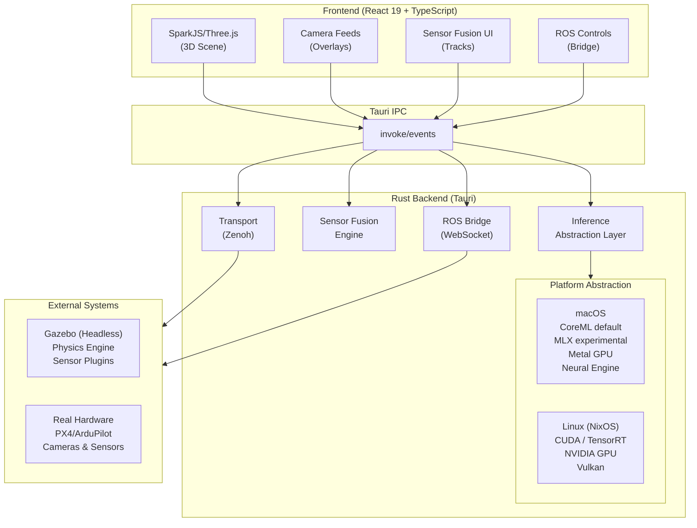
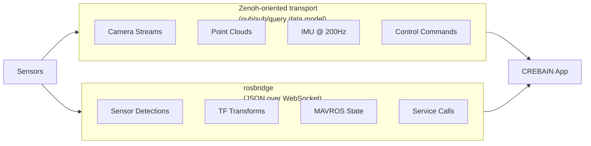
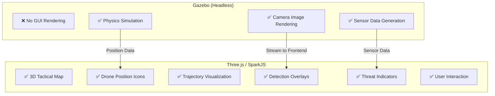
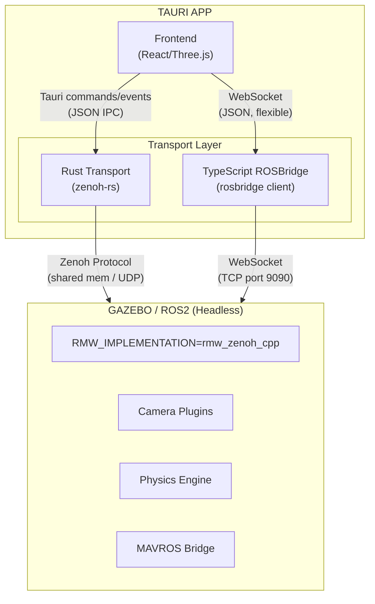
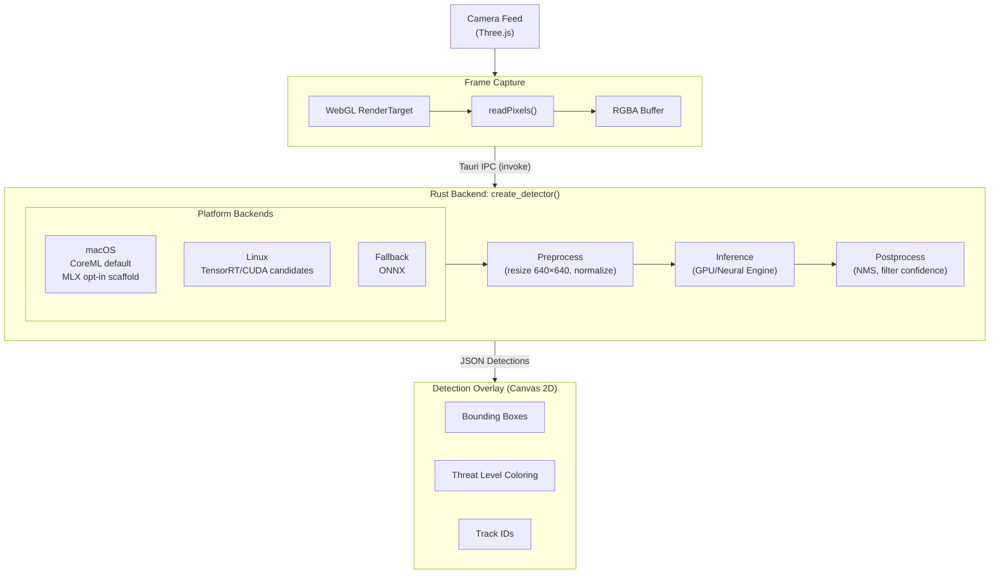
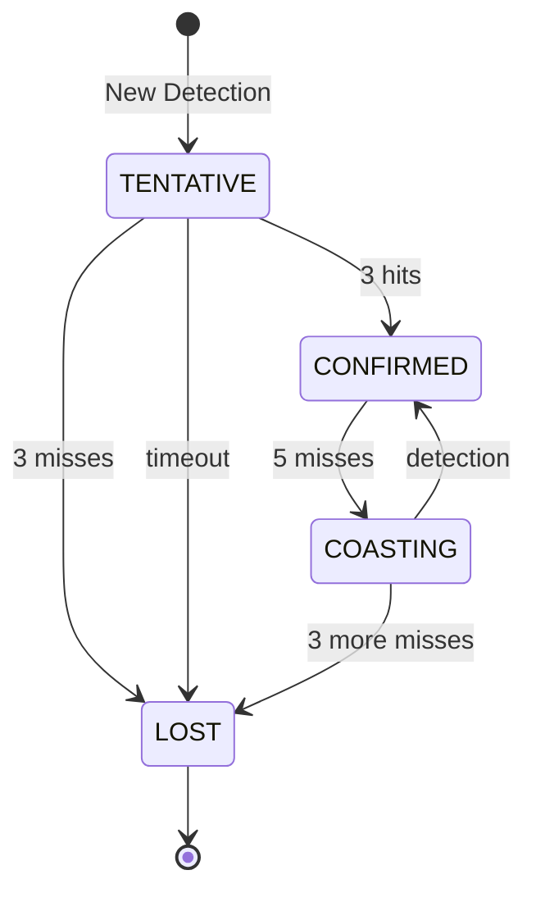

# CREBAIN

**Adaptive Response & Awareness System (ARAS)**

*DE: Adaptives Reaktions- und Aufklärungssystem (ARAS)*
Version 0.4.0

<p align="center">
  
</p>

A research-oriented tactical visualization and autonomy prototype with 3D scene rendering, multi-camera surveillance, ML-assisted detection, multi-modal sensor fusion, drone physics simulation, and ROS/Gazebo integration. Built with Tauri 2, React 19, SparkJS/Three.js, Rust, and optional platform-native inference backends.

---

## Table of Contents

- [Features](#features)
- [Architecture Overview](#architecture-overview)
- [Design Philosophy](#design-philosophy)
- [Technology Stack](#technology-stack)
- [Installation](#installation)
  - [macOS (Apple Silicon)](#macos-apple-silicon)
  - [NixOS (NVIDIA CUDA)](#nixos-nvidia-cuda)
- [Usage](#usage)
- [Keyboard Controls](#keyboard-controls)
- [System Architecture](#system-architecture)
  - [Frontend Architecture](#frontend-architecture)
  - [Backend Architecture](#backend-architecture)
  - [Communication Layer](#communication-layer)
- [ML Inference Pipeline](#ml-inference-pipeline)
- [Sensor Fusion System](#sensor-fusion-system)
- [ROS-Gazebo Integration](#ros-gazebo-integration)
- [Communication Protocols](#communication-protocols)
- [Cross-Platform Support](#cross-platform-support)
- [Performance Optimizations](#performance-optimizations)
- [Evidence and Sources](#evidence-and-sources)
- [Configuration](#configuration)
- [Project Structure](#project-structure)
- [Validation](#validation)
- [Development Roadmap](#development-roadmap)
- [Next 10 Steps](#next-10-steps)
- [Contributing](#contributing)
- [Disclaimer](#disclaimer)
- [License](#license)

---

## Features

### Core Capabilities

| Capability | Description | Status |
|------------|-------------|--------|
| **3D Visualization** | Gaussian Splatting + GLB/GLTF models via Three.js | Prototype |
| **Multi-Camera Surveillance** | Up to 4 simultaneous camera feeds with PTZ control | Prototype |
| **ML Detection** | Object detection pipeline with CoreML/ONNX paths and experimental backends | Prototype |
| **Sensor Fusion** | 5 filter algorithms (KF/EKF/UKF/PF/IMM) for multi-modal tracking | Prototype |
| **Drone Physics** | 120Hz quadcopter aerodynamics simulation | In Progress |
| **ROS Integration** | rosbridge WebSocket + Zenoh-oriented transport paths | In Progress |
| **Cross-Platform** | macOS (Apple Silicon) + NixOS (CUDA) | In Progress |

### 3D Visualization
- **Gaussian Splatting**: Load and view 3D Gaussian Splat scenes (.spz, .ply, .splat, .ksplat)
- **GLB/GLTF Support**: Import 3D models for tactical overlays
- **Rendering**: Three.js-based rendering; WebGPU/WebGL behavior depends on runtime support and renderer configuration
- **First-Person Navigation**: WASD movement, Q/E for vertical, Shift to sprint
- **Drone Visualization**: Live 3D drone models with rotor animation

### Multi-Camera Surveillance System
- **Camera Types**:
  - `SK` (Statische Kamera): Fixed surveillance position
  - `PTZ` (Pan-Tilt-Zoom): Full PTZ control with sliders
  - `PK` (Patrouillenkamera): Automated waypoint patrol
- **Live Feeds**: Up to 4 camera feeds rendered simultaneously at 12 FPS
- **Feed Export**: Download individual camera captures as PNG
- **Detection Overlay**: Bounding boxes on camera feeds
- **Camera Management**: Place, rename, and remove cameras via UI

### ML Detection Pipeline
- **Platform-Native Acceleration**:
  - macOS: CoreML by default; MLX is experimental, opt-in, and currently a forward-pass scaffold
  - Linux: CUDA / TensorRT (NVIDIA GPU)
  - Fallback: ONNX Runtime (CPU)
- **YOLO-Family Models**: Detection backends are designed around YOLO-style model outputs; model weights are not shipped in this repository
- **Detection Classes** (tactical mapping):
  - `drone` - project-specific high-priority class
  - `bird` - environmental
  - `aircraft` - potentially friendly
  - `helicopter` - potentially friendly
  - `unknown` - requires analysis

### Advanced Sensor Fusion

| Algorithm | Use Case | Notes |
|-----------|----------|-------|
| **Kalman Filter (KF)** | Linear constant-velocity tracking | Baseline linear filter |
| **Extended Kalman Filter (EKF)** | Non-linear with linearization | Uses local linearization |
| **Unscented Kalman Filter (UKF)** | Highly non-linear systems | Avoids explicit Jacobian calculation |
| **Particle Filter (PF)** | Multi-modal distributions | Sampling-based approximation |
| **IMM** | Maneuvering targets | Switches between motion models |

### UI/UX
- **Classification UI**: VS-NfD-style label for research UI context; this is not an accreditation claim
- **Threat Level Indicators**: Project-specific 5-level system (0=unknown to 4=critical)
- **Austere UI Aesthetic**: Grayscale with tactical color meaning only
- **German Localization**: German-first interface labels
- **Draggable Panels**: All panels can be repositioned with edge snapping
- **Responsive Design**: All text uses em-based scaling for consistency

---

## Architecture Overview



---

## Design Philosophy

### 1. Measurement-Driven Communication Architecture

**Problem**: Robotics UIs often mix control, perception, telemetry, and diagnostics data with very different latency, throughput, and debuggability needs.

**Solution**: Use rosbridge where dynamic JSON/WebSocket integration is useful, use Zenoh-oriented transport paths for typed robotics data where available, and measure end-to-end latency in the target deployment before making performance claims.



**Zenoh-oriented transport**: Use for typed robotics data and deployments where its pub/sub/query model fits the system design.

**rosbridge**: Use for flexible ROS integration, diagnostics, and JavaScript/WebSocket clients.

**Tauri events**: Use for small frontend/backend notifications. Tauri’s own documentation notes that events are JSON and are not intended for low-latency or high-throughput streaming; use measured alternatives before treating an event path as a high-bandwidth data plane.

### 2. Platform-Native Performance

**Problem**: Different deployment targets expose different inference accelerators, model formats, and runtime constraints.

**Solution**: Prefer the validated backend for the host platform, report backend availability in diagnostics, and keep experimental backends opt-in until their behavior is measured and complete.

```rust
// Automatic backend selection
pub fn create_detector() -> Box<dyn Detector> {
    #[cfg(target_os = "macos")]
    {
        // Apple Silicon: CoreML > experimental MLX (opt-in) > ONNX
        if coreml::is_available() { return Box::new(CoreMlDetector::new()); }
        if experimental_mlx_enabled() && mlx::is_available() {
            return Box::new(MlxDetector::new());
        }
    }
    #[cfg(target_os = "linux")]
    {
        // NVIDIA: TensorRT > CUDA > ONNX
        if tensorrt::is_available() { return Box::new(TensorRtDetector::new()); }
        if cuda::is_available() { return Box::new(CudaDetector::new()); }
    }
    Box::new(OnnxDetector::new()) // Universal fallback
}
```

**Justification**:
- CoreML is Apple’s supported framework for integrating machine-learning models into Apple-platform apps
- MLX is intentionally opt-in until its YOLOv8 forward pass is fully implemented
- TensorRT is NVIDIA’s SDK for optimizing inference engines on NVIDIA GPUs
- ONNX Runtime provides a cross-platform inference fallback and supports multiple hardware/OS targets

### 3. Headless Simulation, Rich Visualization

**Problem**: Gazebo's GUI competes for GPU resources and doesn't integrate with custom UIs.

**Solution**: Run Gazebo headless; render everything in SparkJS/Three.js.



**Gazebo**: GPU not wasted on 3D viewport - focused on physics and sensors  
**Three.js**: Full control over UX with 60fps interactive UI

### 4. Sim2Real Awareness

**Problem**: Simulated sensor data doesn't transfer perfectly to real hardware.

**Solution**: Use simulation for logic testing, not perception training.

| Use Gazebo For | Don't Use Gazebo For |
|----------------|---------------------|
| UI/UX development | Final detection model training |
| Integration testing | Control loop tuning |
| Mission state machines | Aerodynamic performance |
| Multi-drone coordination | Real sensor noise modeling |
| Safe failure mode testing | Production deployment |

### 5. Reproducible Builds

**Problem**: "Works on my machine" - different CUDA versions, missing dependencies.

**Solution**: Nix flake for hermetic, reproducible builds across platforms.

```bash
# Same command works on macOS and NixOS
nix develop   # Enter dev environment with all dependencies
nix build     # Build for current platform
```

---

## Technology Stack

| Layer | Technology | Justification |
|-------|------------|---------------|
| **Frontend** | React 19, TypeScript, Tailwind 4 | Typed UI with current React/Tailwind releases |
| **3D Rendering** | Three.js, @sparkjsdev/spark | 3D scene rendering and Gaussian Splatting support |
| **Desktop Framework** | Tauri 2.10 (Rust) | Rust-backed desktop shell with documented command/event IPC |
| **ML Inference** | CoreML + experimental MLX (macOS), TensorRT/CUDA (Linux), ONNX fallback | Platform-native acceleration paths with measured fallback behavior |
| **Sensor Fusion** | nalgebra (Rust) | Linear algebra support for Rust fusion filters |
| **Transport** | Zenoh-oriented Rust transport, rosbridge WebSocket, Tauri commands/events | Typed robotics data + flexible diagnostics + desktop IPC |
| **Build System** | Nix, Cargo, Vite, Bun | Reproducible shell/build support and package-script automation |

---

## Installation

### macOS (Apple Silicon)

```bash
# Prerequisites
xcode-select --install
brew install bun rust

# Clone and setup
git clone https://github.com/crebain/crebain.git

# From the repository root
bun install

# Build backend (CoreML is used automatically on macOS)
cargo build --manifest-path src-tauri/Cargo.toml --release

# Run
bun run tauri:dev
```

### NixOS (NVIDIA CUDA)

```bash
# Clone
git clone https://github.com/crebain/crebain.git

# Enter Nix dev environment (auto-detects CUDA on NixOS with NVIDIA drivers)
nix develop
#
# If CUDA isn't detected (or you're on a non-standard setup), force the CUDA shell:
# nix develop .#cuda
#
# The Nix shells set `LD_LIBRARY_PATH` for CUDA/TensorRT and driver libraries.
# If you hit an ONNX Runtime load/version error, set `ORT_DYLIB_PATH` to a compatible `libonnxruntime.so`.

# Install frontend deps and run
bun install
bun run tauri:dev
```

### Model Setup

Place your ML model in the appropriate format:

| Platform | Model Path | Format |
|----------|-----------|--------|
| macOS | `CREBAIN_MODEL_PATH=/path/to/model.mlmodelc` | CoreML (`.mlmodelc` directory) |
| Linux (NVIDIA) | `CREBAIN_ONNX_MODEL=/path/to/model.onnx` | ONNX (CUDA/TensorRT via ONNX Runtime) |

This repo does **not** ship model weights. Provide your own model files and ensure you have the rights to redistribute them.

For local development you can also drop models into these paths (ignored by git):

- `src-tauri/resources/yolov8s.mlmodelc/` (macOS)
- `src-tauri/resources/yolov8s.onnx` (Linux)

Or set environment variables:
```bash
export CREBAIN_MODEL_PATH=/path/to/your/model
export CREBAIN_ONNX_MODEL=/path/to/your/model.onnx
```

---

## Usage

1. **Launch the app**: `bun run tauri:dev`
2. **Load a scene**: Drag and drop a .spz/.ply/.splat file, or use Ctrl+O
3. **Place cameras**: Press 1/2/3 to enter camera placement mode, click to place
4. **Enable detection**: Detection runs automatically on camera feeds
5. **View performance**: Press P to toggle the performance panel
6. **Sensor fusion**: Press U to toggle the sensor fusion panel
7. **Connect ROS**: Press N to open the ROS connection panel

---

## Keyboard Controls

### Navigation
| Key | Action |
|-----|--------|
| W/A/S/D | Move forward/left/back/right |
| Q/E | Move down/up |
| Shift | Sprint (3x speed) |
| Ctrl | Precision mode (0.2x speed) |
| Space | Emergency stop |
| R | Reset camera to origin |

### Camera System
| Key | Action |
|-----|--------|
| 1 | Place Static Camera (SK) |
| 2 | Place PTZ Camera |
| 3 | Place Patrol Camera (PK) |
| Tab | Cycle through cameras |
| V | Toggle camera feeds |

### Panels & UI
| Key | Action |
|-----|--------|
| P | Toggle Performance Panel |
| F | Focus scene content |
| G | Toggle 3D grid |
| N | Toggle ROS Connection Panel |
| U | Toggle Sensor Fusion Panel |
| T | Toggle detection panel |
| Y | Toggle detection on/off |

---

## System Architecture

### Frontend Architecture

```
src/
├── components/
│   ├── CrebainViewer.tsx      # Main 3D viewer (orchestrates everything)
│   ├── CameraFeed.tsx         # Individual camera with detection overlay
│   ├── CameraGrid.tsx         # Multi-camera layout
│   ├── DetectionOverlay.tsx   # Bounding box rendering
│   └── *Panel.tsx             # Draggable UI panels
│
├── hooks/
│   ├── useGazeboDrones.ts     # Drone state from ROS (CircularBuffer, memoized)
│   ├── useGazeboSimulation.ts # Continuous guidance controller
│   ├── useROSSensors.ts       # Sensor fusion integration
│   └── useDraggable.ts        # Shared panel drag logic
│
├── ros/
│   ├── ROSBridge.ts           # WebSocket client (rosbridge)
│   ├── ROSCameraStream.ts     # Camera frame decoding
│   ├── GuidanceController.ts  # 20Hz PD control loop
│   ├── TransformManager.ts    # TF tree with caching
│   └── WaypointManager.ts     # MAVROS mission support
│
└── lib/
    ├── CircularBuffer.ts      # O(1) position history
    └── mathUtils.ts           # Optimized vector math (distanceSquared)
```

### Backend Architecture

```
src-tauri/src/
├── lib.rs                # Tauri commands (IPC entry points)
├── main.rs               # Native app entry
│
├── inference/            # ML abstraction layer
│   ├── mod.rs            # Detector trait + factory
│   ├── coreml.rs         # macOS CoreML backend
│   ├── mlx.rs            # macOS MLX backend scaffold (experimental)
│   ├── cuda.rs           # Linux CUDA backend
│   ├── tensorrt.rs       # Linux TensorRT backend
│   └── onnx.rs           # Cross-platform fallback
│
├── transport/            # Communication layer
│   ├── mod.rs            # Transport trait + types
│   └── zenoh.rs          # Zenoh implementation
│
└── sensor_fusion.rs      # KF/EKF/UKF/PF/IMM filters
```

### Communication Layer



---

## ML Inference Pipeline

### Detection Flow



### Performance Measurement

Performance depends on hardware, model format, model size, runtime provider, image size, batching, and whether the native Tauri app or browser-only path is being used. Treat any latency target as invalid until it is reproduced with the benchmark scripts on the deployment hardware.

Use:

```bash
bun run test:benchmark
```

The default validation suite skips benchmark tests unless `RUN_BENCHMARKS=1` is set.

---

## Sensor Fusion System

### Filter Selection Guide

| Scenario | Recommended Filter | Why |
|----------|-------------------|-----|
| Constant velocity targets | Kalman Filter | Standard linear Gaussian baseline |
| Radar/acoustic (non-linear) | Extended Kalman | Handles measurement non-linearity |
| Highly non-linear dynamics | Unscented Kalman | No Jacobian computation |
| Multi-modal distributions | Particle Filter | Handles non-Gaussian |
| Maneuvering targets | IMM | Switches between motion models |

### Track State Machine



---

## ROS-Gazebo Integration

### Supported Topics

```yaml
# Drone State (subscribe)
/gazebo/model_states:              gazebo_msgs/ModelStates
/mavros/*/local_position/pose:     geometry_msgs/PoseStamped
/mavros/*/state:                   mavros_msgs/State

# Camera (subscribe via Zenoh)
/*/camera/image_raw/compressed:    sensor_msgs/CompressedImage
/*/camera/camera_info:             sensor_msgs/CameraInfo

# Control (publish)
/mavros/*/setpoint_position/local: geometry_msgs/PoseStamped
/mavros/*/setpoint_velocity/cmd_vel: geometry_msgs/TwistStamped

# Sensor Fusion (subscribe)
/crebain/thermal/detections:       crebain_msgs/ThermalDetectionArray
/crebain/acoustic/detections:      crebain_msgs/AcousticDetectionArray
/crebain/radar/detections:         crebain_msgs/RadarDetectionArray
```

### Quick Start

```bash
# Terminal 1: Gazebo (headless) with Zenoh RMW
export RMW_IMPLEMENTATION=rmw_zenoh_cpp
gzserver --headless your_world.sdf

# Terminal 2: CREBAIN
bun run tauri:dev
```

---

## Communication Protocols

### Protocol Comparison

| Factor | rosbridge (WebSocket) | Zenoh (Native) |
|--------|----------------------|----------------|
| **Latency** | Deployment-dependent | Deployment-dependent |
| **Throughput** | Deployment-dependent | Deployment-dependent |
| **CPU Usage** | JSON parsing overhead applies | Depends on topology and payload path |
| **Setup** | Easy | Requires RMW change |
| **Add Sensors** | Dynamic JSON messages | Needs Rust-side topic/type handling |
| **ROS1 Support** | Yes | No |
| **Debugging** | Browser DevTools | Harder |

### When to Use Each

**rosbridge**: Development, ROS1/ROS2 WebSocket integration, experimental sensors, flexibility needed

**Zenoh-oriented transport**: Typed robotics data and deployments that benefit from Zenoh’s pub/sub/query model; benchmark in your own topology before depending on a latency target

---

## Cross-Platform Support

### Platform Matrix

| Component | macOS (Apple Silicon) | NixOS (NVIDIA) |
|-----------|----------------------|----------------|
| ML Inference | CoreML default / MLX experimental opt-in | CUDA / TensorRT |
| GPU Compute | Metal-family APIs where supported | CUDA where supported |
| 3D Rendering | Runtime-dependent WebGPU/WebGL behavior | Runtime-dependent WebGPU/WebGL behavior |
| Build System | Nix / Homebrew | Nix |
| Gazebo | Native / Docker | Native |

### Environment Variables

| Variable | Description | Values |
|----------|-------------|--------|
| `CREBAIN_MODEL_PATH` | ML model path | Path to `.mlmodelc` or `.onnx` |
| `CREBAIN_ONNX_MODEL` | ONNX model path (override) | Path to `.onnx` |
| `CREBAIN_BACKEND` | Force ML backend | `coreml`, `mlx`, `tensorrt`, `cuda`, `onnx` |
| `CREBAIN_ENABLE_EXPERIMENTAL_MLX` | Allow experimental MLX auto-selection on Apple Silicon; MLX still returns scaffolded zero-output detections until the real YOLOv8 forward pass lands | `1` / `true` |
| `CREBAIN_TRT_CACHE_DIR` | TensorRT engine cache dir | Directory path (Linux) |
| `CREBAIN_DISABLE_TRT_CACHE` | Disable TensorRT caching | `1` / `true` |
| `ORT_DYLIB_PATH` | ONNX Runtime library path (load-dynamic) | Path to `libonnxruntime.*` |
| `CREBAIN_ZENOH` | Enable Zenoh | `1` (default) or `0` |
| `RMW_IMPLEMENTATION` | ROS2 middleware | `rmw_zenoh_cpp` |

---

## Performance Optimizations

### Implemented Optimizations

| Optimization | Location | Impact |
|--------------|----------|--------|
| CircularBuffer for position history | `useGazeboDrones.ts` | O(n) → O(1) |
| Memoized derived state | `useGazeboDrones.ts` | No recompute on every render |
| Squared distance comparisons | `InterceptionSystem.ts` | Avoids sqrt() |
| Selective trajectory prediction | `useGazeboSimulation.ts` | Avoids unnecessary prediction work |
| 20Hz continuous guidance | `GuidanceController.ts` | Smooth control |
| Stable config refs | Various hooks | Avoids effect re-runs |
| ImageBitmap decoding | `ROSCameraStream.ts` | Browser-native image decode path |

### Benchmarking

| Metric | Value |
|--------|-------|
| ML Inference | Measure with `bun run test:benchmark` and backend diagnostics |
| Sensor Fusion | Covered by unit/smoke tests; add target-hardware benchmarks before release claims |
| Camera Render | Measure in browser/native performance tooling |
| Physics Step | Validate against the simulation rate used in the active scenario |
| Total Frame Time | Measure end-to-end on target hardware |

---

## Evidence and Sources

This README distinguishes project-owned implementation claims from external technology claims:

- **Project-owned claims**: Backed by source code, tests, or the latest `bun run validate:all` result in this repository.
- **Performance claims**: Not treated as release guarantees unless reproduced with repository benchmarks on the target hardware and model files.
- **External technology claims**: Cross-checked against primary documentation where possible.

Primary references used for external claims:

| Topic | Source |
|-------|--------|
| Tauri commands and frontend-to-Rust IPC | [Tauri: Calling Rust from the Frontend](https://v2.tauri.app/develop/calling-rust/) |
| Tauri event limitations and Rust-to-frontend events | [Tauri: Calling the Frontend from Rust](https://v2.tauri.app/develop/calling-frontend/) |
| React 19 availability | [React v19 release notes](https://react.dev/blog/2024/12/05/react-19) |
| Three.js WebGPU/WebGL fallback behavior | [Three.js WebGPURenderer docs](https://threejs.org/docs/pages/WebGPURenderer.html) |
| Spark Gaussian Splatting integration with Three.js | [Spark getting started docs](https://sparkjs.dev/docs/) |
| Zenoh pub/sub/query model | [Zenoh: What is Zenoh?](https://zenoh.io/docs/overview/what-is-zenoh/) |
| rosbridge JSON/WebSocket bridge behavior | [RobotWebTools rosbridge_suite](https://github.com/RobotWebTools/rosbridge_suite) |
| ROS 2 topics model | [ROS 2: Understanding topics](https://docs.ros.org/en/humble/Tutorials/Beginner-CLI-Tools/Understanding-ROS2-Topics/Understanding-ROS2-Topics.html) |
| Gazebo sensors and simulation plugins | [Gazebo sensors tutorial](https://gazebosim.org/docs/latest/sensors/) |
| Core ML purpose | [Apple Core ML documentation](https://developer.apple.com/documentation/coreml) |
| TensorRT purpose | [NVIDIA TensorRT documentation](https://docs.nvidia.com/deeplearning/tensorrt/latest/index.html) |
| ONNX Runtime cross-platform inference | [ONNX Runtime documentation](https://onnxruntime.ai/docs/) |
| YOLOv8 model family | [Ultralytics YOLOv8 documentation](https://docs.ultralytics.com/models/yolov8/) |
| nalgebra Rust linear algebra | [nalgebra documentation](https://www.nalgebra.rs/docs/) |
| Rapier physics engine | [Rapier documentation](https://rapier.rs/docs/) |
| Vite build tooling | [Vite getting started docs](https://vite.dev/guide/) |
| Vitest test runner | [Vitest getting started docs](https://vitest.dev/guide/) |
| Bun runtime/package/test tooling | [Bun documentation](https://bun.com/docs) |
| Tailwind CSS v4 status | [Tailwind CSS v4.0 release notes](https://tailwindcss.com/blog/tailwindcss-v4) |
| Nix declarative development environments | [Nix/NixOS documentation](https://nixos.org/) |

---

## Configuration

### Detection Settings

| Parameter | Default | Range |
|-----------|---------|-------|
| Confidence Threshold | 0.25 | 0.0-1.0 |
| IOU Threshold | 0.45 | 0.0-1.0 |
| Max Detections | 100 | 1-1000 |

### Sensor Fusion Settings

| Parameter | Default | Description |
|-----------|---------|-------------|
| Algorithm | EKF | Filter algorithm |
| Process Noise | 1.0 | State uncertainty |
| Measurement Noise | 2.0 | Sensor uncertainty |
| Association Threshold | 10.0m | Track matching distance |

### Guidance Controller Settings

| Parameter | Default | Description |
|-----------|---------|-------------|
| Rate | 20Hz | Control loop frequency |
| Max Velocity | 15 m/s | Speed limit |
| kP | 1.5 | Proportional gain |
| kD | 0.5 | Derivative gain |

---

## Project Structure

```
crebain/
├── src/                          # React frontend
│   ├── components/               # UI components
│   ├── hooks/                    # React hooks
│   ├── ros/                      # ROS integration
│   ├── detection/                # Detection types
│   ├── physics/                  # Drone physics
│   ├── simulation/               # Interception system
│   └── lib/                      # Utilities
│
├── src-tauri/                    # Rust backend
│   ├── src/
│   │   ├── inference/            # ML abstraction layer
│   │   ├── transport/            # Zenoh transport
│   │   └── sensor_fusion.rs      # Filter algorithms
│   ├── native/
│   │   └── coreml-ffi/           # Swift CoreML bridge
│   └── resources/                # ML models
│
├── ros/                          # ROS reference files
│   ├── msg/                      # Message definitions
│   ├── srv/                      # Service definitions
│   └── launch/                   # Launch files
│
├── flake.nix                     # Nix build configuration
├── package.json                  # Frontend dependencies
└── README.md                     # This file
```

---

## Validation

Use the same commands in local development, CI, and PR review:

```bash
# Frontend typecheck + Vitest
bun run validate

# Full validation: frontend + Rust check/test/clippy
bun run validate:all
```

Useful focused checks:

```bash
bun run typecheck
bun run test:run
bun run check:rust
bun run test:rust
bun run clippy:rust
```

Latest validated stabilization baseline:

- **Command**: `bun run validate:all`
- **Frontend**: 152 tests passed, 8 benchmark tests skipped by default
- **Rust**: 67 tests passed
- **Linting**: `cargo clippy -- -D warnings` passed

Release readiness artifacts:

- **Acceptance matrix**: `docs/RELEASE_ACCEPTANCE.md`
- **Model contracts**: `docs/MODEL_CONTRACTS.md`
- **Manual smoke checklist**: `docs/MANUAL_SMOKE_TEST.md`
- **Security threat model**: `SECURITY.md`

---

## Development Roadmap

### Stabilization Baseline (v0.4.x)

- [x] Centralized keyboard shortcut constants and tests
- [x] Centralized Tauri IPC command constants and registration-drift tests
- [x] Detection, diagnostics, scene state, sensor fusion, ROS, Zenoh, and Gazebo mocked test coverage
- [x] ROS namespace normalization and shared WebSocket test helpers
- [x] Frontend validation script and full frontend/Rust validation script
- [x] Runtime diagnostics, benchmark cancellation, backend availability UI, and transport event-name guardrails
- [x] Calibrated detection/fusion scenario fixture and smoke coverage
- [x] Source-contract guardrails for transport topic validation and scene file path/JSON checks

### Near-Term Engineering Focus (v0.5.x)

- [x] Guidance controller loop tests and safety envelope checks
- [x] Backend command registration/source tests in Rust
- [x] End-to-end detection/fusion smoke tests with mocked model outputs
- [x] CI backend alignment to package scripts
- [x] MLX status demoted in user-facing docs and UI while it remains a scaffold
- [x] Release acceptance matrix, model contracts, security threat model, and manual smoke checklist
- [x] Executable negative guard tests for native detection, model path, scene path, and transport topic boundaries
- [ ] Real MLX YOLOv8 forward pass implementation
- [ ] Full Tauri AppHandle-backed negative IPC integration tests for scene/model/transport boundaries
- [ ] Multi-frame scenario tests for track confirmation and motion

### Planned Capability Work (v0.6.x)

- [ ] Hardware-in-the-loop (HIL) testing
- [ ] Real PX4/ArduPilot integration
- [ ] Multi-drone coordination
- [ ] Encrypted communication (Zenoh-TLS)

### Future

- [ ] Edge deployment (Jetson, Apple Silicon Mac Mini)
- [ ] Recorded flight replay
- [ ] AI-assisted threat assessment
- [ ] Integration with C2 systems

---

## Next 10 Steps

These next steps combine recommendations from 10 complementary scientific and engineering perspectives:

| # | Perspective | Next Step | Primary Outcome |
|---|-------------|-----------|-----------------|
| 1 | **Systems Engineer** | Define a release acceptance matrix for detection, fusion, ROS, Zenoh, Gazebo, scene state, and UI workflows | Clear v0.5 release gates |
| 2 | **ML Engineer** | Replace the MLX zero-output scaffold with a real YOLOv8 forward pass or keep it excluded from auto-selection | Honest backend behavior |
| 3 | **Robotics Engineer** | Add multi-frame scenario tests for track confirmation, target motion, and stale-track cleanup | More realistic perception/fusion checks |
| 4 | **Rust Backend Engineer** | Add executable negative IPC tests for scene file, model path, and transport topic rejection paths | Stronger runtime safety |
| 5 | **Security Engineer** | Threat-model local file paths, model loading, ROS URLs, and Zenoh topic/event boundaries | Reduced attack surface |
| 6 | **Frontend Engineer** | Extract reusable hook-test harness utilities for React root setup, `act`, IPC mocks, and cleanup | Less duplicated test code |
| 7 | **Performance Engineer** | Add regression benchmarks for detection conversion, NMS, sensor fusion, transport event routing, and position history | Better latency visibility |
| 8 | **DevOps Engineer** | Add CI artifacts or summaries for frontend/Rust test counts and skipped benchmark tests | Faster PR review |
| 9 | **QA Engineer** | Add manual smoke-test scripts for native app launch, camera placement, detection diagnostics, scene save/load, and ROS connection | Repeatable release checks |
| 10 | **Technical Writer** | Keep README, AGENTS, CONTRIBUTING, SECURITY, ROS, model, and issue-template docs synchronized after each stabilization batch | Lower onboarding friction |

---

## Contributing

1. Fork the repository
2. Create a feature branch (`git checkout -b feature/amazing`)
3. Commit changes (`git commit -m 'Add amazing feature'`)
4. Push to branch (`git push origin feature/amazing`)
5. Open a Pull Request

### Code Quality Requirements

- TypeScript strict mode
- Rust clippy clean
- Use the centralized logger instead of `console.*` in production
- Memoize expensive computations
- Use CircularBuffer for high-frequency data
- Prefer squared distance for comparisons

---

## Disclaimer

This software is provided for **research and educational purposes only**. CREBAIN is intended as a technical demonstration and research platform for studying sensor fusion, multi-modal tracking, and autonomous systems visualization.

**The contributors and maintainers of this project:**

- Make no representations or warranties of any kind concerning the fitness, safety, or suitability of this software for any purpose
- Are not responsible for any direct, indirect, incidental, special, exemplary, or consequential damages arising from the use or misuse of this software
- Do not endorse or encourage any specific application of this technology
- Assume no liability for any actions taken with this software, whether lawful or unlawful

Users are solely responsible for ensuring compliance with all applicable laws, regulations, and ethical guidelines in their jurisdiction. This includes but is not limited to aviation regulations, privacy laws, export controls, and any restrictions on autonomous systems or surveillance technology.

**By using this software, you acknowledge that you understand these terms and accept full responsibility for your use of the software.**

---

## License

MIT License - See [LICENSE](LICENSE) for details.

---

**CREBAIN — Adaptive Response & Awareness System**

*Adaptives Reaktions- und Aufklärungssystem*
